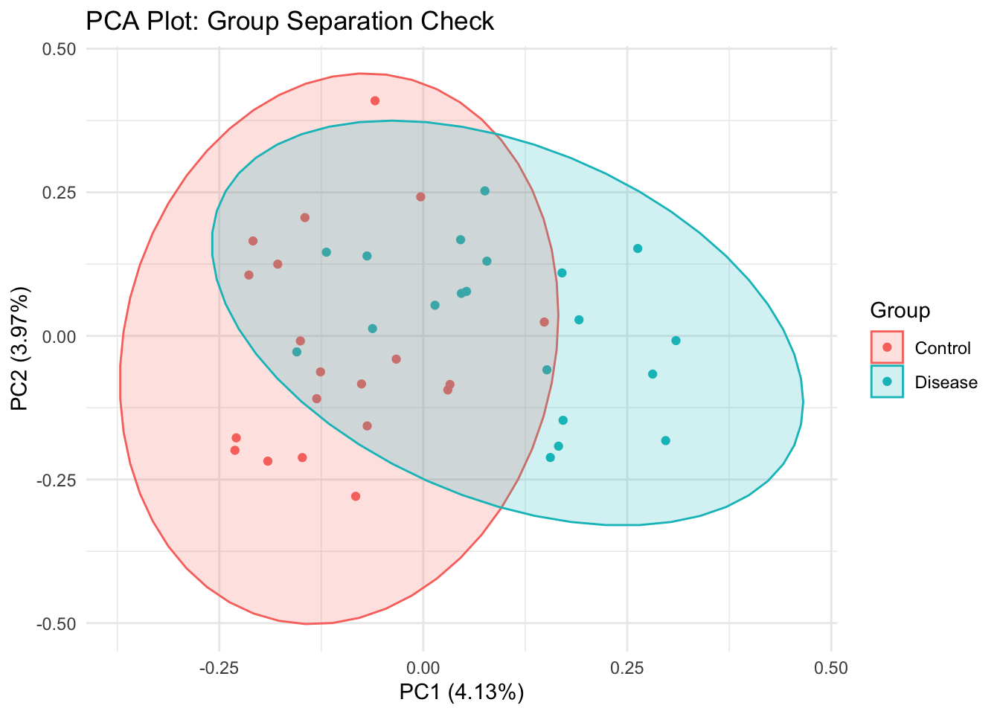
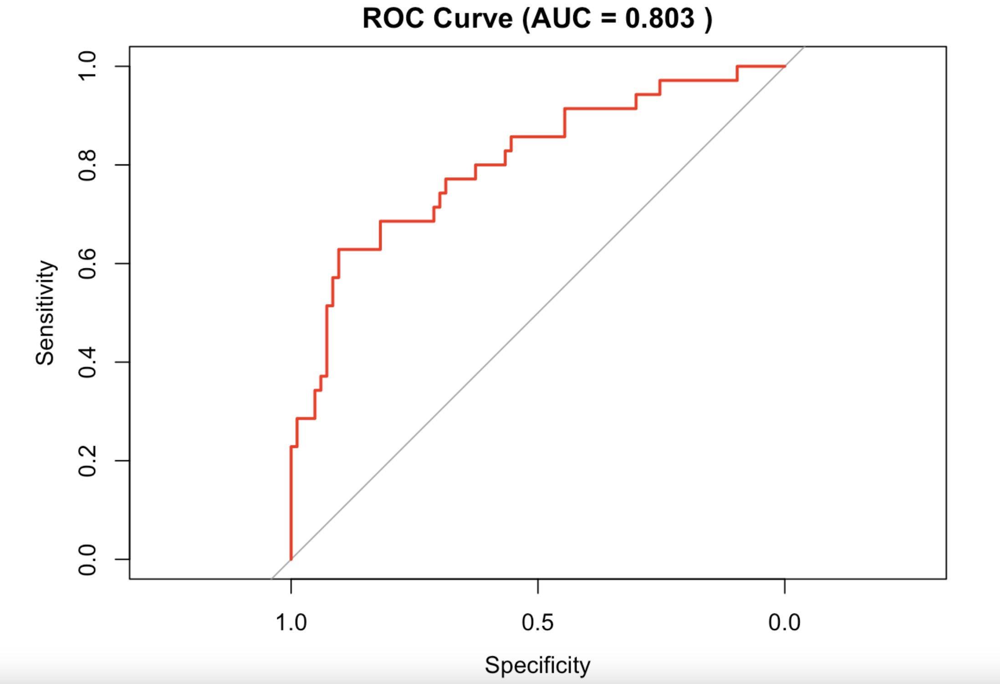
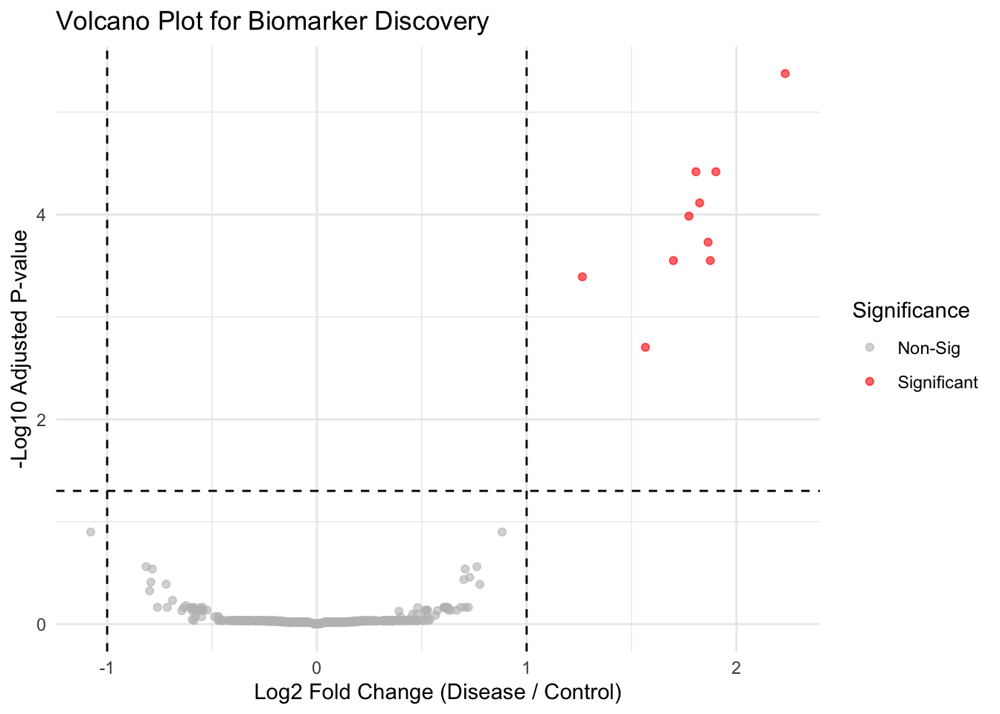
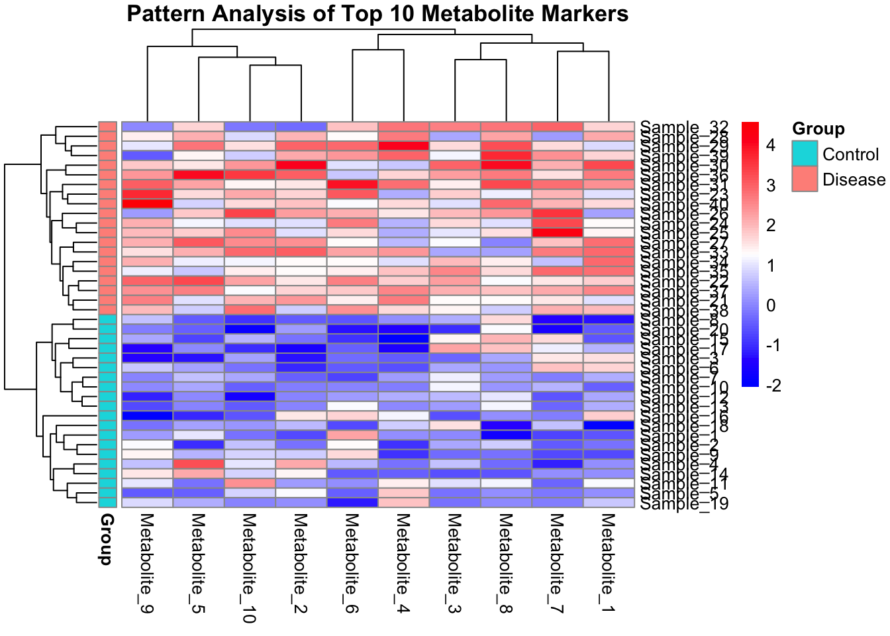

# 🧬 Bio-Data Analysis & Multi-omics Research

안녕하세요, **데이터 기반의 생물학적 통찰을 도출하는 연구자**입니다. 
주로 R을 활용하여 임상 및 대사체 데이터를 분석하며, 통계적 유의성 검증과 시각화를 통해 핵심 바이오마커를 발굴하는 데 집중하고 있습니다. 

## 🚀 Core Skills
* **Languages:** `R` (Advanced), `Python` (Intermediate)
* **Analysis:** Statistical Hypothesis Testing, Multi-omics Data Integration, Metabolomics
* **Visualizations:** `ggplot2`, Heatmaps, Volcano Plots, PCA, ROC Curve
* **Tools:** `Bioconductor`, `Scikit-learn`, `Git/GitHub`

---

## 📂 Featured Projects

### 1️⃣ 당뇨병 유무 예측 및 임상 핵심 인자 발굴 ([리포트 보기](https://github.com/Yang-BBang/Data-Analysis-Study-260417/blob/main/당뇨병_유무_예측_및_핵심_인자_발굴.html))
임상 데이터를 활용하여 질환 예측에 기여하는 핵심 변수를 선별하고 통계적으로 검증한 프로젝트입니다.
* **Key Insight:** * `Glucose`, `Mass`, `Age`가 당뇨병 예측의 주요 인자임을 확인 ($P < 0.05$).
    * **비판적 전처리:** `Pregnant` 변수의 이상치를 제거한 후 재분석을 수행하여, 측정 오류가 통계적 유의성을 왜곡할 수 있음을 증명 ($P$-value $0.05 \rightarrow 0.79$).
* **Tech Stack:** R, Logistic Regression, Outlier Detection, ROC Analysis

### 2️⃣ 대사체 데이터를 활용한 질환 핵심 마커 발굴 ([리포트 보기](https://github.com/Yang-BBang/Data-Analysis-Study-260417/blob/main/대사체_데이터를_활용한_질환_핵심_마커_발굴.html))
수천 개의 대사체 데이터 중 질환군과 대조군을 구분 짓는 유의미한 마커를 발굴하는 프로세스를 구축했습니다.
* **Key Insight:** * **Volcano Plot**을 활용하여 Fold Change와 P-value를 동시에 만족하는 유의 대사체 선별.
    * **PCA & Heatmap** 시각화를 통해 그룹 간의 명확한 패턴 차이 및 변별력 증명.
* **Tech Stack:** R, Bioconductor, PCA, Data Normalization

---

## 📈 Analysis Visualizations
분석 과정에서 도출된 핵심 시각화 결과물입니다. (PNG 파일로 저장 후 연결 권장)

| PCA Plot | ROC Curve |
| :---: | :---: |
|  |  |
| **Volcano Plot** | **Heatmap** |
|  |  |

---

## 🎯 Next Step & Future Goals
* **Python Integration:** R에서 선별된 핵심 인자들을 기반으로 Python `Scikit-learn`을 활용한 머신러닝 예측 모델(Random Forest 등) 고도화 예정.
* **Multi-omics Integration:** 전사체(Transcriptomics)와 대사체(Metabolomics) 데이터를 통합하여 생물학적 기전을 심층 분석하는 연구 지향.
