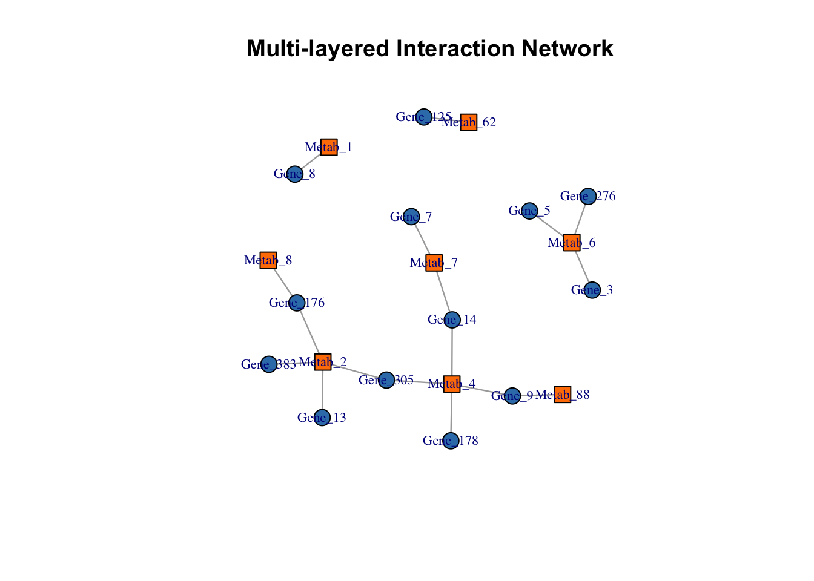
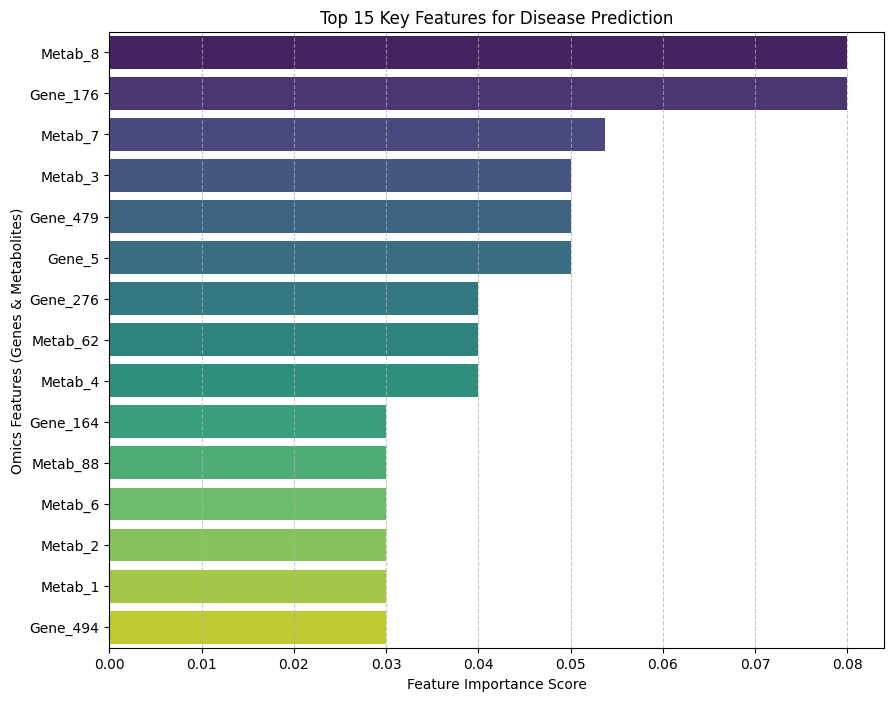
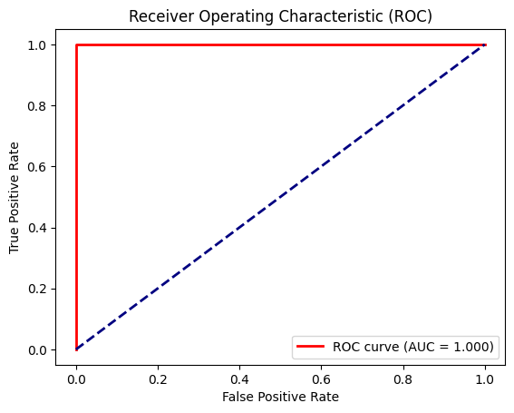

# DATA-ANALYSIS-STUDY

R과 Python을 활용한 데이터 분석 학습 기록 저장소입니다. 기초 문법부터 시작하여 데이터셋을 활용한 분석 실습 과정을 기록하고 있습니다.

---

## Repository Structure

### [Python-Language](./Python-Language)
* **Python-Basic**: 기초 문법 및 데이터 구조 학습
* **Python-Data-Analysis**: 라이브러리를 활용한 데이터 처리 실습

### [R-Language](./R-Language)
* **R-Basic**: R 프로그래밍 기초 및 통계 기초
* **R-Data-Analysis**: 실전 데이터 분석 스크립트
  * **당뇨병 유무 예측 및 핵심 인자 발굴**: 분류 모델 구축 및 변수 분석
  * **대사체 데이터를 활용한 질환 핵심 마커 발굴**: 바이오마커 추출 및 시각화
  * **멀티오믹스 데이터 통합 분석**: 전사체-대사체 통합 및 상관관계 분석

---

## Core Skills (Current)

### Languages
* `R`: 데이터 전처리, 통계 분석 및 시각화 (PCA, Volcano Plot) - 주력 사용
* `Python`: Pandas, Scikit-learn을 활용한 머신러닝 모델링 및 성능 검증(ROC-AUC)

### Analysis & Visualization
* **Omics Data Analysis**: 전사체-대사체 간 통합 분석 및 이종 데이터 레이어 간의 상관관계 규명
* **Visualizations**: ggplot2(R), Seaborn(Python)을 활용한 다각적 시각화 (PCA, Volcano, Heatmap, Feature Importance)
* **Modeling**: Random Forest 기반 질환 판별 모델링 및 ROC-AUC를 활용한 분류 성능 정밀 검증

---

## Tools
* `VS Code`, `RStudio`, `Git`, `GitHub`

---

## Featured Projects

### 1️⃣ 당뇨병 유무 예측 및 임상 핵심 인자 발굴 ([리포트 보기](https://htmlpreview.github.io/?https://github.com/Yang-BBang/Data-Analysis-Study-260417/blob/main/R-Language/R-Data-Analysis/당뇨병_유무_예측_및_핵심_인자_발굴.html))
임상 데이터를 활용하여 질환 예측에 기여하는 핵심 변수를 선별하고 통계적으로 검증한 프로젝트입니다.
* **Key Insight:** 
    * `Glucose`가 당뇨병 예측의 압도적 주요 인자임을 확인 하였으며, `Mass`, `pedigree`, `Age` 또한 주요 인자임을 확인 ($P < 0.05$).
    * **비판적 전처리:** `Pregnant` 변수의 이상치를 제거한 후 재분석을 수행하여, 측정 오류가 통계적 유의성을 왜곡할 수 있음을 증명 ($P$-value $0.006 \rightarrow 0.79$).

| ROC Curve |
| :---: |
|  |

---

### 2️⃣ 대사체 데이터를 활용한 질환 핵심 마커 발굴 ([리포트 보기](https://htmlpreview.github.io/?https://github.com/Yang-BBang/Data-Analysis-Study-260417/blob/main/R-Language/R-Data-Analysis/대사체_데이터를_활용한_질환_핵심_마커_발굴.html))
가상의 대사체 데이터 중 질환군과 대조군을 구분 짓고 유의미한 마커를 발굴하는 프로세스를 연습했습니다.
* **Key Insight:** 
    * **Volcano Plot**을 활용하여 Fold Change와 P-value를 동시에 만족하는 유의 대사체 선별.
    * **PCA & Heatmap** 시각화를 통해 그룹 간의 명확한 패턴 차이 및 변별력 증명.

| PCA Plot | Volcano Plot | Heatmap |
| :---: | :---: | :---: |
|  |  |  |

---

### 3️⃣ 멀티오믹스 데이터 통합 기반 질환 핵심 마커 발굴([리포트 보기](https://htmlpreview.github.io/?https://github.com/Yang-BBang/Data-Analysis-Study-260417/blob/main/R-Language/R-Data-Analysis/멀티오믹스_통합_기반_질환_핵심_마커_발굴.html))
전사체(Transcriptomics)와 대사체(Metabolomics) 등 서로 다른 층위의 데이터를 통합하여 질환의 분자적 메커니즘을 다각도로 분석한 프로젝트입니다.
* **Key Insight:** 
    * **Data Integration:** 서로 다른 오믹스 데이터 간의 상관관계를 분석하여, 특정 유전자 발현 변화가 대사산물 농도 변화에 미치는 영향을 통계적으로 규명.
    * **Pathway Analysis:** 유의미한 유전자와 대사체를 관련 생물학적 경로(Pathway)에 매핑하여 질환 특이적 네트워크를 시각화.
    * **Multi-modal Interpretation:** 단일 오믹스 분석으로는 포착하기 어려운 생체 내 복합적인 상호작용 시스템을 통합적 관점에서 해석.    

| Multi-omics Integration |
| :---: |
|  |

---

### 4️⃣ 멀티오믹스 데이터를 활용한 머신러닝 예측 모델 구축 ([리포트 보기](https://github.com/Yang-BBang/Data-Analysis-Study-260417/blob/main/Python-Language/Python-Data-Analysis/멀티오믹스_데이터를_활용한_머신러닝_예측_모델_구축.ipynb))
멀티오믹스 통합 데이터를 Python으로 이관하여 머신러닝 모델을 구축하고, 모델의 판별 성능을 정밀 검증한 Jupyter Notebook(.ipynb) 기반 프로젝트입니다.
* **Key Insight:** 
    * **ML Model Implementation:** `Scikit-learn`의 Random Forest 알고리즘을 활용한 분류 모델 구현 및 하이퍼파라미터 활용.
    * **Performance Metrics:** ROC-AUC (1.000) 점수를 통해 모델의 판별 성능을 정량화하고 시각화 지표 제시.
    * **Methodological Focus:** 가상 데이터의 특성을 인지하고, 전처리부터 성능 평가까지 이어지는 분석 파이프라인 구축에 중점.

| Feature Importance | ROC Curve |
| :---: | :---: |
|  |  |

